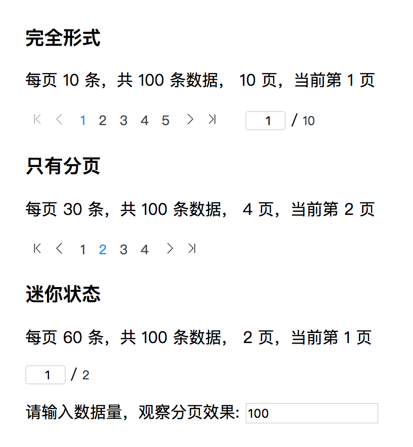

# ASteps

用于 AngularJs 1.x 中的流程导航功能。

## 效果展示


## 使用

1. 添加 Directive

  ```javascript
   angular
   .directive('aPages', function () {
    return {
      restrict: 'EA',
      scope: {
        total: '=ngTotal',
        ngCurrent: '=',
        size: '=ngPageSize',
        // 分页类型 ['all', 'pages', 'min']
        type: '=ngType',
        onChange: '&'
      },
      link: function(scope, element, attrs) {
        // 计算总页数
        scope.totalPages = Math.ceil(scope.total / scope.size)
        // 分页列表
        scope.filter = [-5, -4, -3, -2, -1, 0, 1, 2, 3, 4, 5]
        scope.list = []
        scope.current = scope.ngCurrent

        scope.top = function () {
          scope.current = 1
        }

        scope.prev = function () {
          if (scope.current > 1) {
            scope.current--
          }
        }

        scope.next = function () {
          if (scope.current < scope.totalPages) {
            scope.current++
          }
        }

        scope.bottom = function () {
          scope.current = scope.totalPages
        }

        scope.goTo = function (val) {
          if (val !== scope.current) scope.current = val
        }

        scope.$watch('current', function(now, old) {
          // 过滤空内容
          if (!now) return
          // 字符转数字
          now = parseInt(now)

          // 控制输入内容的合法性
          if (now > scope.totalPages) scope.current = scope.totalPages
          else if (now < 1) scope.current = 1
          // 输出返回当前页数
          scope.ngCurrent = now

          // 分页数字表处理
          scope.list = scope.filter.map(function(val) {
            var _v = now + val
            return {
              label: _v,
              style: _v == now
            }
          })

          // 截取位置计算
          var s = now <= 4 ? 5 - now +1 : 3

          if (scope.totalPages > 5 && now + 2 > scope.totalPages) {
            s = scope.totalPages - now + 1
          }

          scope.list = scope.list.slice(s, s+(scope.totalPages > 5 ? 5 : scope.totalPages))

          scope.onChange({page:now})
        })
        
      },
      // 注意修改你的路径
      templateUrl: '../APages.html'
    }
  })
   ```

2. 页面使用

```html
<a-pages ng-total="total" ng-type="'all'" ng-current="oneCurrent" ng-page-size="10" on-change="rootChange(page)"></a-pages>
```

   ngStepsData 接受一个数组内容。


## 属性说明

| 参数     | 类型                             | 说明     |
| -------- | -------------------------------- | -------- |
| ng-total    | number                           | 数据总数     |
| ng-current | number                           | 当前页数 |
| ng-page-size  | number                           | 每页显示数量     |
| ng-type   | ['all'，'pages'，'min'] | 分页显示效果     |

## 事件
| 方法 | 说明 |  
| --- | --- |
| on-change | 分页变化后事件，返回当前页数(page) |

